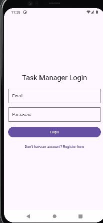
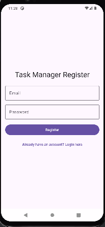
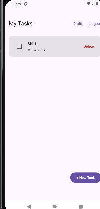
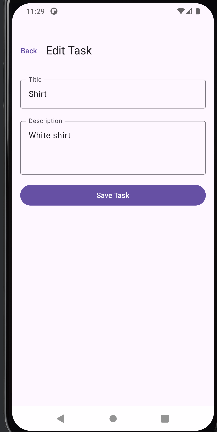
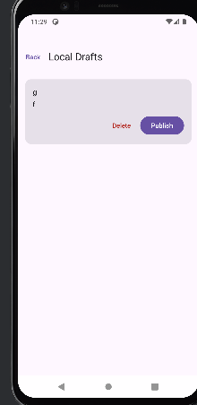

# Gestor Personal de Tareas - Actividad Final Android

## 1. Descripción y Equipo
Esta aplicación es un **Gestor Personal de Tareas** diseñado para permitir a los usuarios administrar sus pendientes tanto de forma remota como local. La aplicación permite el registro e inicio de sesión de usuarios, garantizando que cada persona solo pueda acceder a su propia información mediante una integración segura con Firebase. Además, cuenta con un sistema de borradores locales que permite trabajar sin conexión a internet.

**Integrantes del equipo:**
*   Alexander Pérez Ortiz

## 2. Tecnologías y Arquitectura Implementadas

### Tecnologías:
*   **Lenguaje:** Kotlin 2.x
*   **Interfaz de Usuario:** Jetpack Compose con Material 3.
*   **Inyección de Dependencias:** Hilt.
*   **Base de Datos Remota:** Firebase (Authentication & Cloud Firestore).
*   **Persistencia Local:** Room (para la gestión de borradores).
*   **Navegación:** Navigation Compose.
*   **Asincronía:** Corrutinas de Kotlin y StateFlow para el manejo de estados reactivos.

### Arquitectura:
Se ha implementado una arquitectura **MVVM (Model-View-ViewModel)** siguiendo los principios de **Clean Architecture**, dividiendo el proyecto en tres capas principales:
1.  **Capa de Dominio (Domain):** Contiene los modelos de datos puros, las interfaces de los repositorios y los casos de uso que definen la lógica de negocio.
2.  **Capa de Datos (Data):** Implementa los repositorios, gestiona las fuentes de datos (Firestore y Room) y realiza el mapeo de datos entre capas.
3.  **Capa de UI:** Compuesta por Composable Screens y ViewModels que gestionan el estado de la interfaz de forma inmutable.

## 3. Instrucciones de Configuración y Ejecución

### Requisitos Previos:
*   Android Studio Ladybug o superior.
*   Java 17 instalado y configurado.

### Pasos para Configurar Firebase:
1.  Crea un proyecto en [Firebase Console](https://console.firebase.google.com/).
2.  Registra una aplicación Android con el ID de paquete: `com.example.actividadfinalandroid`.
3.  Descarga el archivo `google-services.json` y colócalo en la carpeta `app/` del proyecto.
4.  Habilita **Firebase Authentication** con el método "Correo electrónico/Contraseña".
5.  Crea una base de datos **Cloud Firestore** e inicia en "Modo de prueba" (o aplica las reglas de seguridad proporcionadas en el taller).

### Ejecución:
1.  Abre el proyecto en Android Studio.
2.  Espera a que Gradle sincronice las dependencias.
3.  Haz clic en el botón **Run** (triángulo verde) para instalar la app en un emulador o dispositivo físico.

## 4. Explicación de la Estructura de Paquetes

La estructura sigue el estándar de Clean Architecture:

*   `data/`: Implementaciones de acceso a datos.
    *   `local/`: Configuración de Room (DAOs, Entidades, Base de Datos).
    *   `remote/`: Modelos específicos de red (si aplica) y lógica de Firestore.
    *   `mapper/`: Clases para transformar modelos de datos a modelos de dominio.
    *   `repository/`: Implementaciones concretas de las interfaces definidas en domain.
*   `di/`: Módulos de Hilt para la provisión de dependencias (Firebase, Database, Repositories).
*   `domain/`: Núcleo de la lógica de negocio.
    *   `model/`: Modelos de datos puros.
    *   `repository/`: Definición de interfaces de acceso a datos.
    *   `use_case/`: Clases que ejecutan acciones específicas (CRUD, Auth).
*   `ui/`: Capa de presentación.
    *   `navigation/`: Configuración del grafo de navegación y rutas.
    *   `screen/`: Pantallas de Compose y sus respectivos ViewModels.
    *   `theme/`: Configuración de colores, tipografía y estilos de Material 3.

## 5. Funcionalidades Terminadas y Errores Conocidos

### Funcionalidades:
*   [x] **Registro de Usuarios:** Validación de campos y creación de cuenta en Firebase.
*   [x] **Inicio de Sesión:** Autenticación segura y persistencia de sesión.
*   [x] **CRUD Firestore:** Crear, leer, actualizar y eliminar tareas en la nube.
*   [x] **Seguridad:** Filtrado de datos por `ownerId` y reglas de seguridad aplicadas.
*   [x] **Borradores (Room):** Guardar tareas localmente cuando no hay internet.
*   [x] **Publicación de Borradores:** Proceso seguro de subida a Firestore y limpieza automática en Room tras éxito.

### Errores Conocidos:
*   *Ninguno reportado hasta el momento.* La app ha sido probada con múltiples usuarios y cumple con el flujo de publicación segura.

## 6. Capturas de Pantalla

| Pantalla de Login | Pantalla de Registro | Lista de Tareas |
| :---: | :---: | :---: |
|  |  |  |

| Formulario de Tarea | Lista de Borradores |
| :---: | :---: |
|  |  |
